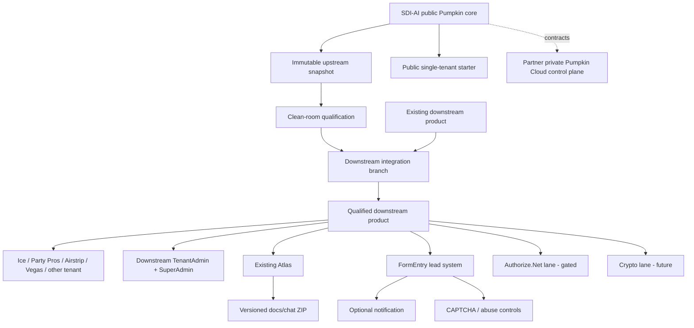

# Pumpkin Build Atlas — Proposed Fallback v2.0

## Current position

```text
Upstream observed: 785e079269276c177832f9e7186ae44675e76f52
Public downstream observed: 64156a3015943f08bc89cadb2caae910d5cadf4f
Latest partner merge visible: no
Active integrated build inventoried: no
Existing Atlas inventoried: no
CAPTCHA decision: blocked by next upstream inspection
Authorize.Net: blocked pending Shawn push
Next gate: preserve/inventory downstream build and existing Atlas
```

## System map



## Capability truth

See `capability-matrix.json`. Claimed downstream capabilities remain unverified until the active build is inspected. Partner plans remain external until their commits are visible.

## Major invariants

- upstream snapshot is immutable;
- downstream product history/capabilities are preserved;
- semantic decisions precede integration;
- FormEntry is authoritative;
- email is secondary;
- CAPTCHA is server verified;
- payment is tokenized/hosted and separately recorded;
- Atlas/package update closes every major milestone.
